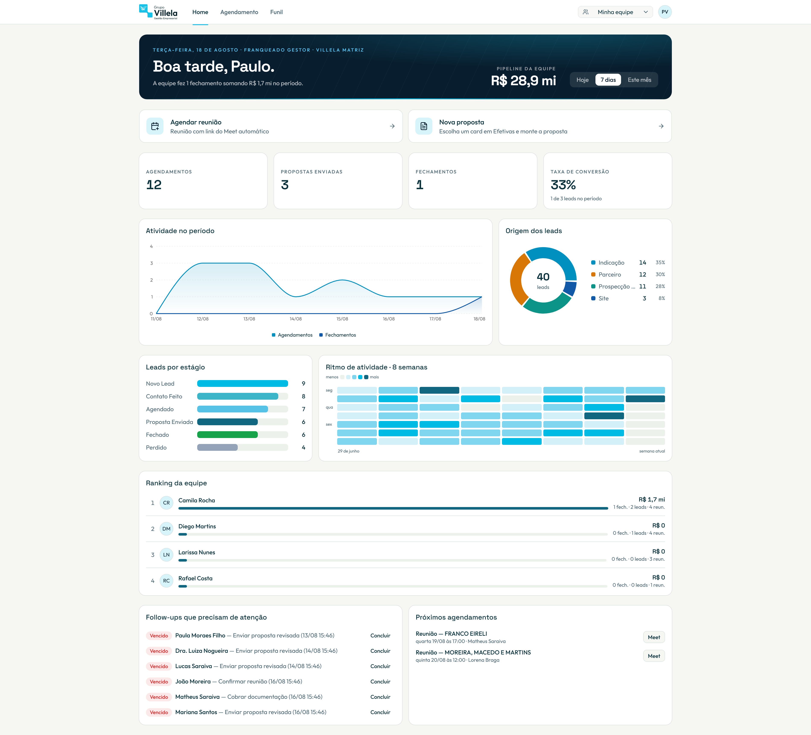
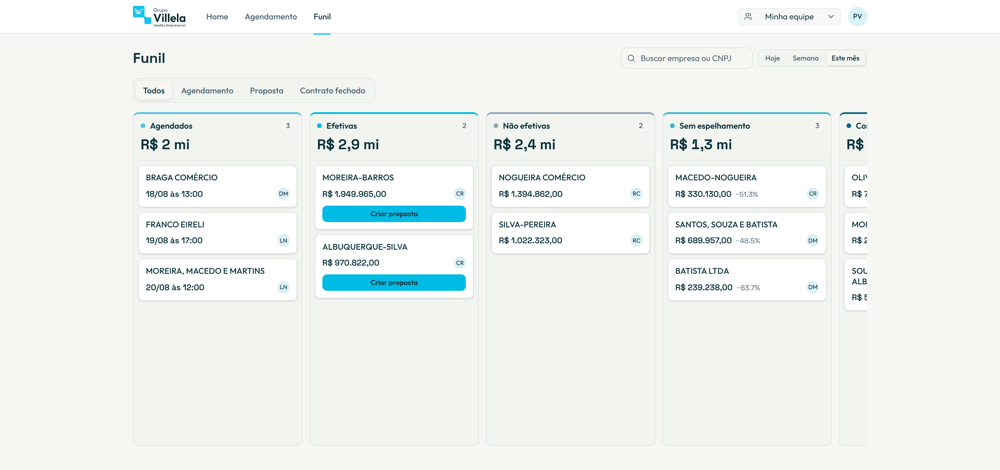
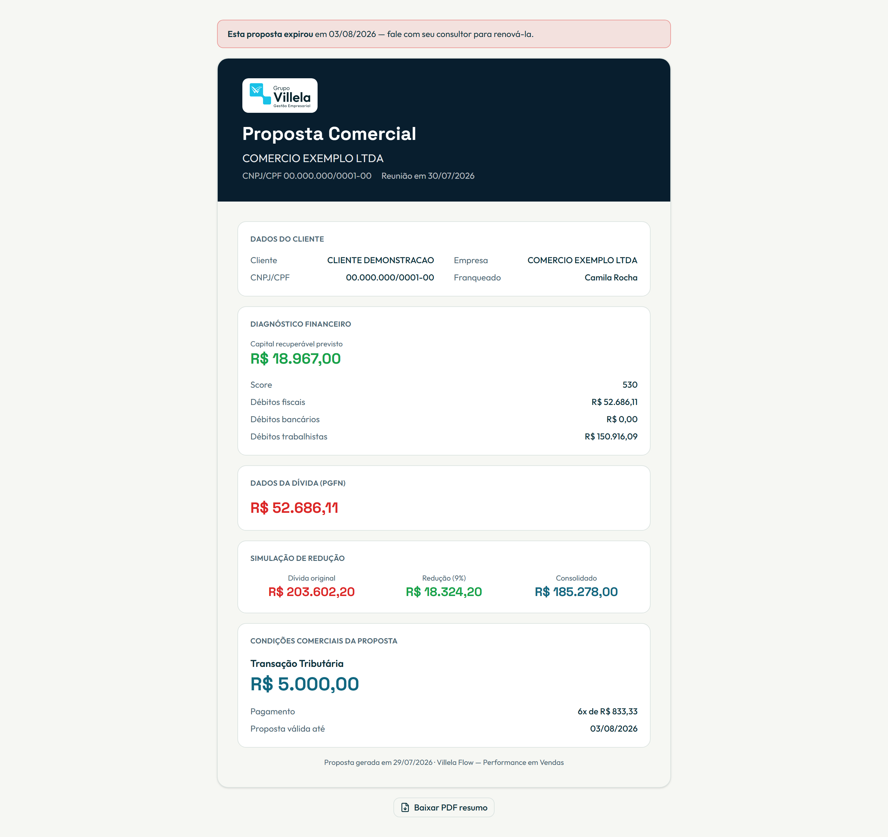

# Villela Flow

**CRM de vendas enxuto para um time de campo.** Uma home que muda por papel, com métricas e
ranking de equipe; agendamento que provisiona um Google Meet automaticamente; e um funil
unificado — da reunião ao contrato pago — onde a etapa do card é *derivada* dos fatos
(pagamento > contrato > proposta > reunião), nunca armazenada. Propostas comerciais públicas em
PDF fecham o ciclo. Feito com Next.js 16 e Supabase.

> 🇬🇧 [Read in English](./README.md)

> **Sobre dados e credenciais.** Este é um repositório de portfólio de um projeto feito para um
> cliente (Grupo Villela). Pessoas, empresas e identificadores de relatório reais nos fixtures
> foram trocados por valores fictícios; todo segredo vive apenas no `.env.local` (nunca versionado); runbooks internos e atas foram removidos. Nenhum dado
> pessoal real ou credencial está presente neste repositório ou no seu histórico.

---

## Telas

| Home do gestor | Funil unificado | Proposta pública |
|---|---|---|
|  |  |  |

## O que faz

- **Home por papel** — o afiliado (`sdr`) vê só o próprio trabalho, o gestor (`gerente`) vê a
  equipe e um ranking, o VP (`vp`) vê todas as equipes e um comparativo. O escopo é aplicado na
  camada de aplicação (`src/lib/escopo.ts`) sobre a RLS do Supabase.
- **Agendamento** — marca reuniões e cria o link do Google Meet automaticamente. O OAuth do Google
  é um **fluxo próprio server-side** (não o do Supabase), porque o Supabase Auth perde o
  `provider_token` no refresh; o refresh token é guardado cifrado (AES-256-GCM).
- **Funil unificado** — um Kanban de sete colunas, de "agendado" a "contrato pago". A etapa é
  **derivada, não armazenada**: `classificar.ts` resolve em cascata (pagamento > contrato >
  proposta > status da reunião), então nenhum card fica em "pago" sem pagamento. Arrastar um card
  grava a *causa* (uma proposta, um pagamento), e uma matriz de transições bloqueia retrocessos
  ilegais. "Expirando" é um **selo**, não uma coluna — o card fica onde o vendedor espera.
- **Propostas públicas** — uma página pública tokenizada (`/proposta/[token]`) renderiza a proposta
  comercial como PDF para download (`@react-pdf/renderer`), sem login.
- **Entrada por relatório de diagnóstico** — o agendamento parte de um link de relatório que
  pré-preenche a reunião; um parser puro transforma o relatório em dados estruturados do funil.

Veja **[docs/ARCHITECTURE.md](docs/ARCHITECTURE.md)** e o log de ADRs em
[docs/decisoes.md](docs/decisoes.md) para as decisões de projeto.

## Stack

Next.js 16.2 (App Router, Turbopack) · React 19 · TypeScript (strict) · Tailwind v4 ·
shadcn/ui · Supabase (Auth + Postgres + RLS) · Google Calendar/Meet API · zod v4 ·
`@react-pdf/renderer` · Vitest.

## Como rodar

**Pré-requisitos:** Node ≥ 20, npm, um projeto Supabase.

```bash
npm install
# create .env.local — preencha os valores abaixo
npx supabase link                 # vincule seu projeto Supabase
npx supabase db push              # aplica as migrations (supabase/migrations)
npm run seed -- --reset           # dados demo fictícios (faker, com seed fixa)
npm run dev                       # http://localhost:3005
```

### Variáveis de ambiente

As variáveis:

| Variável | Para quê |
|---|---|
| `NEXT_PUBLIC_SUPABASE_URL` / `NEXT_PUBLIC_SUPABASE_PUBLISHABLE_KEY` | client Supabase |
| `SUPABASE_SECRET_KEY` | chave Supabase server-only (nunca `NEXT_PUBLIC_`) |
| `GOOGLE_CLIENT_ID` / `GOOGLE_CLIENT_SECRET` / `GOOGLE_REDIRECT_URI` | OAuth Calendar/Meet |
| `GOOGLE_STATE_SECRET` / `TOKEN_ENCRYPTION_KEY` | assinatura do state + cifra do refresh token (base64 de 32 bytes) |
| `APP_URL` | URL base pública |

O projeto usa o novo formato de chaves `sb_publishable_…` / `sb_secret_…` (as chaves legadas
`anon`/`service_role` estão sendo descontinuadas).

## Testes

Dezenove suítes Vitest cobrem as camadas puras — classificação do funil e matriz de transições,
filtro de escopo, ranking, cálculo de períodos, prefill/precificação de proposta, cripto de token
e o parser de diagnóstico — sem acesso à rede (o fetch é stubado):

```bash
npm test          # vitest run
npm run typecheck # tsc --noEmit
npm run lint
```

O CI ([`.github/workflows/ci.yml`](.github/workflows/ci.yml)) roda lint, typecheck e as suítes a
cada push. O seed demo usa `fakerPT_BR` com seed fixa — todas as identidades são fabricadas.

## Estrutura

```
src/
  app/(app)/      home, agendamento, funil, administração, configurações
  app/(auth)/     login, cadastro, aguardando-aprovação
  app/proposta/   página pública tokenizada de proposta
  app/api/google/ callback próprio do OAuth Google
  actions/        server actions
  lib/            lógica pura (funil-unificado, diagnostico, proposta-comercial, escopo,
                  ranking, metricas, crypto, validators) + adapters supabase/ google/
  components/     componentes de domínio + ui (shadcn)
supabase/migrations/  0001..0006 (RLS no 0002)
scripts/seed.ts       dados demo com faker
docs/                 ARCHITECTURE.md, decisoes.md (log de ADRs)
```

## Licença

Portfólio — todos os direitos reservados © Emanuel Jordan. Veja [LICENSE](./LICENSE).
Feito para o Grupo Villela; publicado para avaliação de portfólio.
